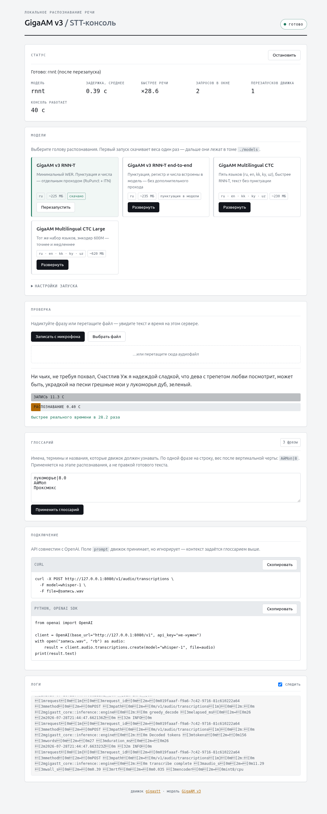

# STT-консоль: локальное распознавание русской речи

Свой сервер распознавания речи с OpenAI-совместимым API и веб-консолью: выбрали
голову GigaAM v3, нажали "Развернуть" - API работает. Рассчитан на диктовку по-русски
на своей машине, без облака и без GPU.

[](LICENSE)
[](pyproject.toml)
[](docker-compose.yml)

Внутри - модель [GigaAM v3](https://github.com/salute-developers/GigaAM) от
SberDevices и движок [gigastt](https://github.com/ekhodzitsky/gigastt): один
Rust-бинарник на ONNX Runtime, INT8, только CPU. Ни PyTorch, ни ffmpeg, ни CUDA не
нужны, образ занимает около 340 МБ. Версия движка закреплена в `GIGASTT_TAG`, само
число - в [`docker-compose.yml`](docker-compose.yml), и здесь оно не дублируется,
чтобы не разъезжалось.



## Содержание

- [Быстрый старт](#быстрый-старт)
- [Какую голову выбрать](#какую-голову-выбрать)
- [Что получилось по скорости](#что-получилось-по-скорости)
- [Как подключить](#как-подключить)
- [Глоссарий и словарь брендов](#глоссарий-и-словарь-брендов)
- [Настройки `.env`](#настройки-env)
- [Что происходит при падениях](#что-происходит-при-падениях)
- [Где что лежит](#где-что-лежит)
- [Если что-то пошло не так](#если-что-то-пошло-не-так)
- [Как это устроено](#как-это-устроено)
- [Разработка](#разработка)
- [Лицензии](#лицензии)

## Быстрый старт

```sh
git clone https://github.com/mazixs/stt-api.git && cd stt-api
cp .env.example .env          # необязательно: без .env возьмутся значения по умолчанию
docker compose up -d
```

Откройте `http://<адрес-сервера>:8091`, нажмите "Развернуть" на карточке
**GigaAM v3 RNN-T end-to-end** и дождитесь статуса "готово". Первый раз качается
~230 МБ весов, дальше они лежат в `models/` и не перекачиваются.

## Какую голову выбрать

| Голова | Языки | Пунктуация | Наш WER, FLEURS ru | 165 с звука | Значок |
|---|---|---|--:|--:|---|
| `e2e_rnnt` | ru | встроена в модель | **4.32%** | 6.6 с | лучшая для русского |
| `ml_ctc_large` | ru, en, kk, ky, uz | отдельным проходом, вручную | 6.25% | 11.2 с | лучшая мультиязычная |
| `rnnt` | ru | отдельным проходом RuPunct + ITN | 6.56% | 6.3 с | |
| `ml_ctc` | ru, en, kk, ky, uz | отдельным проходом, вручную | не мерили | **5.8 с** | |

WER - наш замер 11.08.2026 на 300 фразах русского FLEURS; время - тот же файл
диктовки на 16-ядерном настольном CPU, лучшее из трех прогонов.

**Берите `e2e_rnnt`.** Она точнее остальных и единственная умеет писать то, чем полон
глоссарий: заглавные, латиницу, цифры и дефисы. В словаре `rnnt` только 32 строчные
кириллические буквы, поэтому "OpenWhispr" туда не проходит вовсе. Из 140 фраз нашего
боевого глоссария `e2e_rnnt` пишет все 140.

**`ml_ctc_large` - если нужны пять языков.** Вдвое медленнее, на первом запуске берет
2.5 ГиБ памяти и пишет так же голо, как `rnnt`.

**С внешними лидербордами это не соотносится никак, и это проверено:** у Шмырева
GigaAM v3 нет вовсе (таблица не обновлялась с 14.09.2025), мультиязычный трек HF Open
ASR Leaderboard русского не содержит. Поэтому значки в консоли стоят по нашему замеру
([разбор](docs/research/head-choice-and-wer.md)).

## Что получилось по скорости

Замеры на 16-ядерном настольном CPU, голова `e2e_rnnt`, `POOL_SIZE=1`, лучшее из
трех прогонов, 04.09.2026:

| Запись | Ответ | Быстрее речи |
|---|--:|--:|
| 9 с | 0.30 с | x31 |
| 36 с | 1.38 с | x26 |
| 71 с | 2.52 с | x28 |
| 2.8 мин | 6.32 с | x26 |
| 5.5 мин | 12.97 с | x25 |
| 10.3 мин | 24.53 с | x25 |

На боевой машине с восемью ядрами то же самое выходит вдвое дороже: RTF около 0.05,
следовательно шесть минут диктовки честно стоят примерно 19 секунд ожидания.

**Время растет линейно, и это устройство, а не дефект.** Запись длиннее 30 секунд
движок режет на окна по 24 секунды с перекрытием 2 секунды и проходит их строго одно
за другим. Ускорить это можно было бы только параллельной обработкой окон, которой в
движке нет. Пропуск тишины (`VAD=1`) мы проверили: на записях 3-10 минут он экономит
20-30% времени, но меняет 3% слов, а на короткой диктовке оказывается медленнее, чем
без него, - поэтому остается выключенным
([замер](docs/research/head-choice-and-wer.md)).

Накладные расходы самой консоли - от 5 до 25 миллисекунд, то есть 0.1% на
десятиминутном файле. Ваш сервер, скорее всего, медленнее нашего, поэтому консоль
**измеряет задержку сама** на каждом запросе и показывает ее в разделе "Статус".

**Клиент добавляет свое время сверх нашего.** OpenWhispr для своего `base_url` не
стримит и по умолчанию прогоняет готовый текст через LLM-очистку
([разбор](docs/product.md)).

## Как подключить

API совместим с OpenAI, поэтому подходит любой клиент, умеющий `base_url`:

```sh
curl -X POST http://<сервер>:8091/v1/audio/transcriptions \
  -F model=whisper-1 \
  -F file=@запись.wav
```

```python
from openai import OpenAI

client = OpenAI(base_url="http://<сервер>:8091/v1", api_key="не-нужен")
with open("запись.wav", "rb") as audio:
    print(client.audio.transcriptions.create(model="whisper-1", file=audio).text)
```

Поддерживается: `response_format` = `json`, `text`, `srt`, `vtt`, `verbose_json`;
`timestamp_granularities[]` = `word` / `segment`; `stream=true` (SSE); форматы аудио
WAV, MP3, M4A/AAC, OGG/Vorbis, OGG/Opus, FLAC и WebM/Opus. Поле `model` можно
передавать любое - работает та голова, которую вы развернули.

Не поддерживается: `/v1/audio/translations` (GigaAM не переводит речь) и поле
`prompt` - контекст задается глоссарием.

Две оговорки, обе проверены замером. Если делаете WebM сами, просите `ffmpeg` про
частоту явно (`-ar 48000` перед `-c:a libopus`): движок берет ее из контейнера, и файл
с заголовком не 48 кГц вернет код 200 и пустой текст. А `stream=true` на загруженном
файле почти не дает промежуточного текста - движок получил весь звук сразу; живой
текст требует живого звука, для него проброшен родной `/v1/ws`
([разбор](docs/open-questions.md)).

### Что торчит наружу

Ключ решает все сразу: пустой `API_KEY` - сервис открыт целиком, заданный - закрыто
все, кроме `/health`.

| Путь | Под ключом | Что делает |
|---|---|---|
| `POST /v1/audio/transcriptions` | да | Распознавание, OpenAI-совместимое |
| `GET /v1/models` | да | Четыре головы плюс `whisper-1` для клиентов с зашитым именем |
| `POST /v1/audio/translations` | да | Всегда `400`: GigaAM не переводит речь |
| `GET/POST/DELETE /v1/...` | да | Проброс остальных родных эндпоинтов движка |
| `GET /api/status`, `/api/models`, `/api/glossary` | да | Данные для веб-консоли |
| `POST /api/deploy`, `/api/stop`, `/api/glossary` | да | Развернуть голову, остановить движок, применить глоссарий |
| `POST /api/test` | да | Разовое распознавание с замером времени и RTF |
| `GET /api/events` | да | SSE: статус, прогресс скачивания, логи |
| `GET /api/docs`, `/api/openapi.json` | да | Swagger UI и схема управляющего API |
| `GET /health` | нет | Живость самой консоли: иначе healthcheck Docker перезапускал бы исправный контейнер |

Ключ передается как `Authorization: Bearer <ключ>`, а где заголовок послать нельзя -
как `?api_key=<ключ>`. Таких мест два, и оба браузерные: `EventSource` на
`/api/events` и переход по ссылке на `/api/docs`. Плата обычная для ключа в адресе:
он остается в истории браузера и в логах прокси.

## Глоссарий и словарь брендов

Имена, термины и названия, которые должны распознаваться правильно, задаются в
`.env` переменной `INITIAL_CONTEXT` или прямо в веб-консоли:

```
INITIAL_CONTEXT=АйМоп, GigaAM|8, Петр Иванович Сидоров
```

Разделители - запятая или перевод строки, вес фразы после вертикальной черты, общая
сила подсказки - `HOTWORDS_BOOST`. Это hotword-биасинг: подсказка работает на этапе
декодирования, а не правкой готового текста. Правки применяются без перезапуска,
движок перечитывает список на месте. Импорт, экспорт и добавление по одной фразе - в
консоли; копию стоит забирать время от времени, список живет в томе `data/` и другого
экземпляра у него нет.

**Фразу выбрасывают, если голова не может ее написать.** Регистр тут ни при чем,
движок сам пробует фразу и как написана, и строчными; а вот чужой алфавит не спасает
ничто - `OpenWhispr` недостижим для `rnnt`. Консоль показывает такие фразы
зачеркнутыми, то есть поименно.

**Чего от глоссария ждать не стоит: точного написания английских терминов.** Правило,
проверенное на живой записи: подсказка дотягивает почти угаданное и не выдумывает
неуслышанное - `H20` она поправила в `H200`, а `standart Bird` в `Thunderbird` не
превратила ни при каком бусте ([разбор](docs/research/head-choice-and-wer.md)).

**`HOTWORDS_DEFAULT=1` включен по умолчанию.** Это встроенный словарь движка: 30
бытовых брендов строчной кириллицей (эпл, айфон, яндекс, вайлдберриз). Технической
лексике он не помогает - для нее и есть глоссарий выше. На 27 минутах настоящей
диктовки словарь изменил одно слово из 2654, и в сторону правильного написания
([замер](docs/research/head-choice-and-wer.md)).

**`INITIAL_CONTEXT` читается один раз**, при создании файла глоссария, - дальше
правки в консоли сильнее. Фразы из `.env`, которых в списке нет, консоль покажет
рядом с глоссарием и предложит кнопку "Добавить из .env". Автоматически они не
доливаются намеренно: удаленная в консоли фраза не должна возвращаться после
перезапуска.

## Настройки `.env`

Полный список с пояснениями - в [`.env.example`](.env.example). Главное:

| Переменная | По умолчанию | Смысл |
|---|---|---|
| `HOST_PORT` | `8091` | Порт на сервере |
| `API_KEY` | пусто | Если задан - нужен `Authorization: Bearer <ключ>` |
| `INITIAL_CONTEXT` | пусто | Глоссарий |
| `MODEL_VARIANT` | `rnnt` | Что предвыбрано в консоли |
| `PUNCTUATION` / `ITN` | `auto` | Пунктуация и числа цифрами |
| `HOTWORDS_BOOST` | `5.0` | Сила подсказки глоссария |
| `HOTWORDS_DEFAULT` | `1` | Встроенный словарь из 30 бытовых брендов |
| `VAD` | `0` | Пропуск тишины: экономит время на длинных записях, меняет текст |
| `POOL_SIZE` | `1` | 1 = минимальная задержка, лучшее для диктовки |
| `AUTOSTART` | `1` | Поднимать последнюю модель при старте контейнера |
| `MAX_UPLOAD_MB` | `150` | Лимит размера файла; движку передается он же, с запасом |
| `HF_TOKEN` | пусто | Не нужен: веса берутся с GitHub Releases |

**Состояние сильнее `.env`, и это сделано нарочно.** После первого развертывания
приоритет у `data/state.json`: иначе выбранная в консоли голова откатывалась бы к
значению из файла после каждого перезапуска контейнера. Правка `MODEL_VARIANT` или
`POOL_SIZE` в `.env` поэтому сама по себе ничего не меняет в работающем движке.

Молчать об этом консоль не будет. Расхождение попадает в лог при старте, видно в
разделе "Настройки запуска" человеческими словами и применяется кнопкой "Развернуть с
настройками `.env`". Что развернуто на самом деле, проверяется командой
`ps -eo args | grep "gigastt serve"`, а не эндпоинтом статуса: статус показывает
желаемое. Настройки самой консоли (`API_KEY`, `HOST_PORT`, `MAX_UPLOAD_MB`,
`AUTOSTART`) читаются при старте контейнера и в состоянии не хранятся.

## Что происходит при падениях

| Что упало | Что делает сервис |
|---|---|
| Процесс движка | Консоль поднимает его заново с задержкой 1, 2, 4, 8, 16, 30 с; после пяти неудач подряд - раз в минуту |
| Контейнер целиком | Docker перезапускает (`restart: unless-stopped`), конфигурация читается из `data/state.json` |
| Скачивание весов оборвалось | Два повтора, потом понятная ошибка и кнопка для новой попытки. Работающая модель не останавливается |
| Новая голова не запустилась | Автоматический откат на предыдущую рабочую |

Запросы, попавшие точно в момент падения, теряются - клиент должен повторить. Пока
движок не готов, API отвечает `503` с заголовком `Retry-After`.

Контейнеру заданы потолок памяти в 3 ГБ и ротация логов. Потолок посчитан не по
рабочим ~120 МиБ, а по самому тяжелому мигу - пересборке графа после смены головы
(2538 МиБ у `ml_ctc_large`). Обоснование - в комментариях `docker-compose.yml` и в
[docs/decisions.md](docs/decisions.md).

## Где что лежит

| Путь | Что |
|---|---|
| `models/` | Веса моделей: голова (~230 МБ), пунктуация (~31 МБ), диаризация (~27 МБ) |
| `models/optimized_cache/` | Оптимизированные графы ONNX, ~300 МБ на голову. Убираются командой движка `cache-gc` |
| `data/state.json` | Последняя развернутая конфигурация |
| `data/hotwords.txt` | Глоссарий в формате движка |
| `data/metrics.json` | Счетчики консоли: файлы, секунды звука, время распознавания |

Наружу открыт только порт консоли. Движок слушает `127.0.0.1:9876` внутри
контейнера, поэтому попасть в него можно лишь через консоль, которая проверяет ключ.

## Если что-то пошло не так

**Скачивание обрывается на середине.** Сервис делает два повтора сам. Если не
помогает, скачайте четыре файла весов головы руками с
[релиза движка](https://github.com/ekhodzitsky/gigastt/releases) и положите в
`models/` - консоль увидит их и запустится без скачивания.

**Кнопка "Записать с микрофона" не работает.** Браузеры дают микрофон только на
`localhost` или по HTTPS: откройте консоль через SSH-туннель
(`ssh -L 8091:localhost:8091 сервер`). Распознавание файлов работает всегда.

**Логи.** `docker compose logs -f`, там же вывод движка. Последние строки видны в
консоли в разделе "Логи".

**Занят порт.** Поменяйте `HOST_PORT` в `.env` и `docker compose up -d`.

**`400 Invalid multipart body` на большом файле.** Так отвечали версии до 1.1.1.
Теперь консоль сама задает движку предел с запасом и отказывает текстом про размер
([разбор](docs/decisions.md)).

## Как это устроено

Консоль владеет процессом движка, а не соседствует с ним: `gigastt serve` - ее
дочерний процесс на `127.0.0.1:9876`, наружу не публикуется. Своей сборки Rust в
проекте нет, бинарник берется из образа апстрима.

| Файл | За что отвечает |
|---|---|
| `console/main.py` | Сборка приложения: `Settings` -> `Supervisor` -> FastAPI, три роутера и статика с отпечатком содержимого в ссылках |
| `console/supervisor.py` | Машина состояний (`stopped` / `downloading` / `starting` / `ready` / `error`), откат на последнюю рабочую конфигурацию, сторож упавшего процесса, расхождение с `.env` |
| `console/engine.py` | Жизненный цикл `gigastt serve`: единственное место, где собираются аргументы движка |
| `console/downloader.py` | Скачивание весов командой самого движка, прогресс и контрольные суммы - его же |
| `console/api.py` | Управляющий API консоли под `/api`, включая блок `env` в статусе |
| `console/proxy.py` | Фасад OpenAI: ключ, лимит размера, понятные ошибки при неготовности, замер времени. Тело загрузки уходит в движок байт в байт |
| `console/auth.py` | Проверка `Authorization: Bearer`, выключена при пустом `API_KEY` |
| `console/state.py` | `data/state.json`, запись атомарная: контейнер, убитый на середине, не найдет обрывок |
| `console/catalog.py` | Четыре головы: названия, размеры, файлы весов и значки по нашему замеру |
| `console/vocab.py` | Читает словарь головы с диска и отвечает, какие фразы глоссария движок сможет написать |
| `console/glossary.py` | Разбор списка фраз в формат движка (`data/hotwords.txt`) |
| `console/events.py` | Шина событий, из которой берется SSE `/api/events` |
| `console/metrics.py` | Счетчики в `data/metrics.json` |
| `console/wavinfo.py`, `console/webminfo.py` | Длительность WAV и WebM/Opus без декодирования - только ради RTF, звук не трогают |
| `console/static/` | Фронтенд без сборки и зависимостей. Запись с микрофона собирается в WAV прямо в браузере, поэтому в образе не нужен ffmpeg |

## Разработка

```sh
uv sync          # окружение
uv run pytest    # тесты; движок подменяется заглушкой, ничего не качается
```

Поднять сервис на своей машине лучше через наложение - тогда контейнер не будет
воскресать сам после перезагрузки и не спутается с боевым по имени:

```sh
cp .env.local.example .env.local
docker compose -f docker-compose.yml -f docker-compose.local.yml up -d --build
docker compose -f docker-compose.yml -f docker-compose.local.yml down    # не забыть
```

Версии помечены тегами `vX.Y.Z`, что в них вошло - в [CHANGELOG.md](CHANGELOG.md).
Номер лежит в `console/__init__.py`, оттуда его берут и `pyproject.toml`, и схема на
`/api/openapi.json`.

Ручной сценарий проверки на живом движке - [`docs/manual-smoke.md`](docs/manual-smoke.md).
Остальные документы - [`docs/`](docs/): [о продукте](docs/product.md),
[технические решения](docs/decisions.md),
[выбор головы и замеры](docs/research/head-choice-and-wer.md),
[открытые вопросы](docs/open-questions.md).

## Лицензии

Код консоли - Apache 2.0 ([LICENSE](LICENSE)). Движок gigastt - MIT. Веса
GigaAM v3 - MIT.
